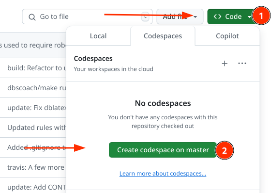

# RoboCupJunior Soccer rules

Welcome to the [RoboCupJunior Soccer](https://junior.robocup.org/) rules
repository for the 2021 season.

Although the rules have already been made made final and released, we are
always on the lookout for changes that may either improve the competition or
simplify the rules (or in the best case, both).

## How do I suggest a change?

Please edit the [`rules.adoc`](https://github.com/RoboCupJuniorTC/soccer-rules/edit/master/rules.adoc)
file. The easiest way of doing that seems to be following the
[GitHub's instructions](https://help.github.com/articles/editing-files-in-another-user-s-repository/)
on how to edit files in another user's repository.

In the end that should
result in a [Pull Request](https://help.github.com/articles/creating-a-pull-request/).

When suggesting a change, please follow the following rules:

1. Small Pull Requests are better than big ones.
2. Please only include one 'change type' (i.e. grammar/structure/gameplay ...)
   in one Pull Request
3. Please make sure to fill in the [Pull Request template](PULL_REQUEST_TEMPLATE.md)

The rules are written in a human readable formatting langue called
[AsciiDoc](https://asciidoctor.org/docs/asciidoc-writers-guide/), which should
make them quite readable and easy to edit, so please feel free to do so!

## That's way too complicated

We do realize it may look like that. If you do not feel comfortable with
suggesting a change using the process above, feel free to create a new thread
on [the RCJ Soccer forum](https://junior.forum.robocup.org/c/robocupjunior-soccer).
Please make sure the title contains the term **Rule Change Suggestion** and
that your submission contains answers to the following sections:

- **Describe your suggestion in one or two sentences**
- **Explain why do you think it should be in the rules**
- **List the relevant section(s) of previous rules (if applicable)**

We can discuss your suggestion there, and if it makes sense someone will
certainly put it into the actual `rules.adoc` document.

## Building the PDF rules on your own

The rules are written in a format called `asciidoc`. It is very similar to
Markdown but unlike Markdown, it is very extensible and has a nice ecosystems
of tools around it. To get a feel for what it looks like, please take a look at
the [AsciiDoc Writer's Guide](https://asciidoctor.org/docs/asciidoc-writers-guide/).

Despite how great it is, the rules cannot be built with AsciiDoc alone. They
need to be exported into PDF, in a specific format, and we'd also like them to
highlight the changes in a nice way and automatically generate IDs for each
paragraph. To do all this, the input AsciiDoc file goes thorugh the following
steps:

1. `AsciiDoc` -> `CriticMarked AsciiDoc` (_to visualize rule changes in red_)
2. `CriticMarked AsciiDoc` -> **HTML**
3. `CriticMarked AsciiDoc` -> `LaTeX` (for formatting purposes)
4. `LaTeX` -> `LaTeX + RCJ Soccer formatting` (_to ensure uniformity of the output_)
5. `LaTeX + RCJ Soccer formatting` -> **PDF**

At the end of this process we end up with a **HTML** and a **PDF** version of
the AsciiDoc file we started with.

This repository is using [GitHub Actions](./github/workflows/) which allows us to
automatically build the rules whenever any change/update
takes place.

If you'd like to try it on your own, it should not be such a big problem,
provided you have [Docker](https://docker.com) installed. You can then go
thorugh the build process in two easy steps:

       docker run -v $(pwd):/documents asciidoctor/docker-asciidoctor .ci/adoc-to-tex.sh rules
       docker run -v $(pwd):/documents mrshu/texlive-dblatex .ci/tex-to-pdf.sh rules

Which will make the `rules.adoc` file (in the current working directory --
that's the `$(pwd)` part) go through the build steps above and generate files
`rules.html` and `rules.pdf` as a result.

## Use GitHub Codespaces to edit these files

GitHub now has a nice service called [Codespaces](https://github.com/features/codespaces)
which allows us to spin up a "development environment" without having to
install various dependencies without having to leave the web browser.

Here is a short tutorial on how to edit the rules in Codespaces.

### Spinning up Codespaces and building the rules

1. First, navigate to the top part of the repository.

2. Click on **Code** and then on **Create codespace on master**

3. You should now be able to navigate the `rules.adoc` and/or `superteam_rules.adoc` files and edit them as you like.

4. To actually build rules as a PDF and/or HTML, you can execute the following:

        ./scripts/build-rules.bash rules

5. After the script has ran, you will see lines such as the following in the output:

        See the HTML version at: http://localhost:12345/tmp_rules.html
        See the PDF version at: http://localhost:12345/tmp_rules.pdf

Clicking on either should bring you to a directory listing, in which you can find `tmp_rules.html` and `tmp_rules.pdf` and have them load. Note that this is now being served from the Codespaces environment (the actual URL will have the `app.github.dev` suffix).
