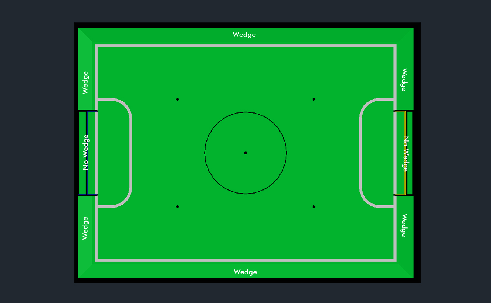
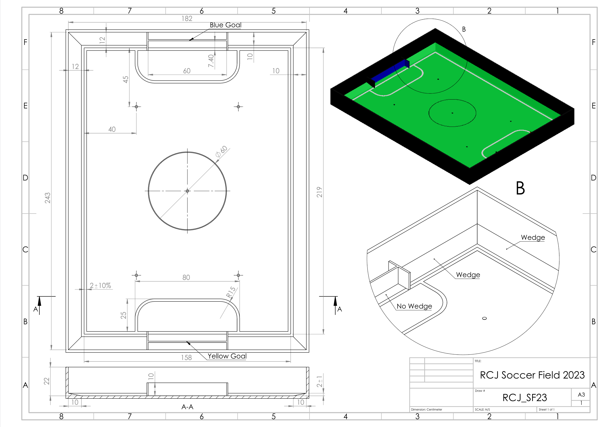

= Technical Specification For Soccer Fields
{docdate}
:toc: left
:sectanchors:
:sectlinks:
:xrefstyle: full
:section-refsig: Rule
:sectnums:

ifdef::basebackend-html[]
++++
<link rel="stylesheet" href="https://use.fontawesome.com/releases/v5.3.1/css/all.css" integrity="sha384-mzrmE5qonljUremFsqc01SB46JvROS7bZs3IO2EmfFsd15uHvIt+Y8vEf7N7fWAU" crossorigin="anonymous">

++++
endif::basebackend-html[]

:icons: font
:numbered:

[[dimensions-of-the-field]]
== Dimensions of the field

The playing field is 158 cm by 219 cm. The field is
marked by a white line which is part of the playing field. Around the
playing field, beyond the white line, there is an outer area
of 12 cm in width.

The floor near the exterior wall includes a wedge, which is an incline with a
10 cm base and 2 +/- 1 cm rise for allowing the ball to roll back into play
when it leaves the playing field. Note that the goal should not contain the
wedge.

Total dimensions of the field, including the outer area, are 182 cm by 243 cm.

[[field-walls]]
== Walls

Walls are placed all around the field, including behind the goals and the
out-area. The height of the walls is 22 cm. The walls are painted matte black.

[[goals]]
== Goals

The field has two goals, centered on each of the shorter sides of the playing
field. The goal inner space is 60 cm wide, 10 cm high and 74 mm deep, box
shaped.

The goal "posts" are positioned over the white line marking the limits of the
field.

The interior walls and of each goal are colored matte, one goal yellow and the
other goal blue. It is recommended that the blue be of a brighter shade so that
it is different enough from the black exterior.

[[floor]]
== Floor

The floor
consists of green carpet ideally of darker shade on top of a hard level surface. Teams
should be prepared to adjust to different levels of contrast between the green carpet
and lines as some events may be restricted to using lighter shades of green. All
lines on the field should be painted, marked with tape,
or installed as white carpet and be somewhat resistant to tearing or ripping.
Lines should have a width of 20mm (±10%).

It is impractical to set international constraints on carpet other than it
being green. In the spirit of the competition, teams should design robots
to be tolerant or adaptable to different fibers, textures, construction,
density, shades, and designs of carpet especially when competing amongst different
regions. Teams are encouraged to visit regional resources or reach out to Local
Organization Committee for suggestions if desiring to build their own practice
field(s).

[[neutral-spots]]
== Neutral spots

There are five neutral spots defined in the field. One is in the center of the
field. The other four are adjacent to each corner, located 45 cm
along the long edge of the field. They align with the sides of the penalty
areas. The neutral spots can be drawn with a thin black marker.
The neutral spots ought to be of circular shape measuring 1 cm in diameter.

[[center-circle]]
== Center circle

A center circle will be drawn on the field. It is 60 cm in diameter. It is a
thin black marker line. It is there as guidance during kick-off.

[[penalty-areas]]
== Penalty areas

In front of each goal there is a 25 cm wide and 80 cm long penalty
area with rounded front corners (15cm radius).

The penalty areas are marked by a white line of 20 mm (±10%) width. The
line is part of the area.

[[lighting-and-magnetic-conditions]]
== Lighting and Magnetic Conditions

The tournament organizers will do their best to limit the amount of external lightning and
magnetic interference. However, the robots need to be constructed in a way
which allows them to work in conditions that are not perfect (i.e. by not
relying on compass sensors or specific lightning conditions).

[discrete]
[[field-diagrams]]
== FIELD DIAGRAMS

[.text-center]

[.text-center]

== Field CAD models

There are STEP and IGES files available that contain a model of the fields.
These are _not authorithative_ and exist mostly for illustration purposes.
footnote:[they can be found at 
https://github.com/robocup-junior/soccer-rules/tree/master/media/CAD]

== Suggestions for getting started with building fields

There is *no standard design* for fields - some notes from experience are
collected below. We will also provide a guidance on how some regions build the fields, in the First appendix. If you have any questions don't hesitate to ask on the usual channels (Discord, Forum, Email, all listed in the main rules)

=== Getting your first field - starting small

If you are a team, school etc. just getting started with RoboCupJunior Soccer
you can start without building a competition-grade field. Get yourself some green carpet and some white tape for the lines. With just having that, you can start building a simple field that can be use the get things off the ground. You can put the carpet on the ground and start building your robots very quicky. The first upgrade could be adding some
walls (maybe you have some cardboard or scrap wood that you can spray
black paint on and put up in a square shape). If you grow out of that it might be
time to build an actual full field. There are designs that can be stored
relatively easily (by folding in half or being taken apart into quarters),
more on that below.

=== Converting existing equipment (esp. for Entry Leagues)

// TODO: Put link for Entry details
If you are considering starting in one of the Entry Leagues and you or your
school have existing fields of any kind, you can repurpose that field into a entry soccor field. For example, First Lego League fields can
be converted to competition-spec entry fields by just laying down carpet and
installing goals. The Entry rules explicitly have a size range so that
existing fields with different sizes can be used.

=== Building Competition Fields
//do we need this section at all?
If you are hosting a competition, you are probably in one of three situations:

- You had built fields that you have been using for practice and, when the competition time arrives, you repurpose them for the competition. Many local
competitions that get hosted by schools do this and it is totally to be expected.
- You are building fields that you only use for the big competitions you are hosting which will not have any use after the competitions are over. In that case we highly recommend building fields that are suitable (i.e. durable, transportable and storable) to be given out to local/regional competition hosts or participating schools in the region to support RoboCupJunior instead of going to waste.
- You are using fields you already have. This is the most common situation and you can repurpose your existing fields into a competition field by just laying down a new carpet.

It may of course also be a combination of these cases or something else
entirely. 

=== Competition conditions

If you are hosting competitions it is worth to make sure all
carpets use the same material, all walls and goals use the same surface finish
(so no matte/shiny differences between fields, no color shade differences
between the goals and so on). Teams greatly appreciate this because it makes
their calibration work a lot better. This also applies to having even lighting.
Try to minimize natural light as much as possible (as it tends to vary significantly), and arrange the fields so that the lighting is as uniform as possible (smartphones can be used to measure this). Also, ensure there are as few shadows on the fields as possible.

If you intend to use your fields for an extended period, avoid using fiberboard (such as MDF), as it is not durable. High-quality plywood is a much more reliable option, although it is more expensive—so it may be worth investing in only after a cheaper field has worn out. Even though the frequency of robots impacting the walls and goals has significantly decreased due to rule changes made between 2022 and 2024, there have still been cases in the past where goals were pulled out of the field structure. Frequently assembling and disassembling the fields can also lead to damage, especially if you have limited storage space and need to transport the fields to tournaments. To address these issues, use fasteners with internal threads rather than screwing directly into the wood. You can also use aluminum brackets on the edges of the baseboard to hold the field together, which makes assembly and disassembly easier.

[[appendix-1]]
[appendix]
== How to Start Building a Field
In this section, we provide a step-by-step guide on how to build your first full-size, competition grade field. You can find the link:https://docs.google.com/spreadsheets/d/17-ZvGeDSzBHwIeh-iJHFqOkcqPsvwN1VsUMdfY3ixr4[Bill of Material] here, however, please read the next section first to make your design choices, and then refer to the bill of material with those design choices in mind.

=== Mobility Criteria
The main consideration when building a field is how much you need to move the field around. This decision effects what kind of base wood and connections you would choose.
Starting with the type of wood, if you do not have a permenant location for the field, we highly recommend to use plywood as it is more durable and easier to transport. If you have a permenant location for the field, you can use cheaper and heavier materials such as MDF. We highly recommend you to not use particle wood as it does not have the much needed strenght and durability. We need to add that if you want to assemble and deassemble the field more than 3 times in its life time, we highly recommend using inside threaded screws to hold the field together. This is because the screws will damage the wood after a couple deassemblies, if they are directly screwed into the wood.

=== Choosing the type of materials
You need to choose different materials for different parts of the field. Here, we want to give you some critera to know what to look for when buying the materials.

==== The woods
For the woods, you need different colors for the goals and the walls. If you order all of the wood working to a shop that has different colors in abundance, it would be better to use precoatted wooden boards that have a matt finish. However, it is quite common to not being able to find the exact color and finishing you need. In that case, you can get the bare wood and paint them with an acrylic paint. That process is a bit messier but the result will be the same.

==== The carpet
The carpet is the most important part of the field. It is the surface that the robots will be moving on and because all of the contact with the wheels, that is the part of the field which get damaged more often. A good carpet is one that does have very good glue and does not have too many loose fibers. This means that the carpet should not be too soft and should not be fluffy at all. You need a surface that has good contact with the wheels and does not slip.

==== The lines
The lines are another part of the field that get run over quite oftenly so they get damaged as well. In the international competitions, we usually aim for using a white and reflective tape as the main goal over there is having the fields in a good shape as quick as possible. However, if you want to build a practice field, it would advisable to use acrylic paint for the lines. This way you can wash them with a cloth when they get dirty and if some part of the paint chips away, you can use a small brush to patch that part up.

=== Building the field
After considering all of the above compromises and gathering all of the needed items from the link:https://docs.google.com/spreadsheets/d/17-ZvGeDSzBHwIeh-iJHFqOkcqPsvwN1VsUMdfY3ixr4[Bill of Material], you can start building the field.

==== building the baseboard and the wedges
The first item in the list is the bottom of the field, the base board. As mentioned in the BOM, you can get a standard 6ft x 4ft piece of board and use that as the base without cutting it. Lay the base on a flat surface preferably a table. Put your wedges on the correct side of the table (wedges should push the ball inside the field) and use a nail gun or screws to hold the wedges in place. You don't need to make them too tight in place because carpet will cover them up and the wall will keep them in place. Do not forget that you are not going to have a wedge behind the goals, so cut the wedges according to the BOM to have the right length. +
 The hardest part is to make the wedges itself, as the ratio of base to height is 5 to 1. You can ask a wood working shop to create that for you, as it needs special machinery to cut such a low angle. +

 If you want to use a aluminum bracket to have a robuster field, now is the time to do it. Put the brackets under the base and use a small piece of wood with the same thickness of your walls as the guide. screw the brackets to the base board and the wedges. We only recommend using the brackets if you are going to assemble and deassemble the field very often. Otherwise, you are not going to need such a structer at all.

==== Laying down the carpet
Use a vaccum cleaner to clean any dust or debris on the base board and use a glue spreader to apply a thin layer of carpet glue to the base board and the wedges. lay down your carpet face down and apply carpet glue to the back of the carpet. Give both sides 2-3 minutes to dry first and then put the glued carpet on the base board. Press down the carpet to remove any air bubbles and make sure it is in place. Leaving the air bubbles will make your field bumpy and uneven.

==== Building the goals
This part does not nee much explaining. Just use regular screws for the type of wood you are using and create a wide H like shape that is going to be your goal. If you are new to wood working, consider that you need to drill a 2.5mm hole into the wood before using the the M3 screws. If you want to make it more beautiful, you can use a countersink drill bit to make the holes look nicer.

==== Painting the walls and the goals (optional)
If you need to paint the walls and the goals, now is the time to do it. You can use a single paint brush as the acrylic paint is washable with water and you can just wash your brush after each color. Start with the black and paint all of your wall pieces. Then move paint the outside of the goal posts and back of the goal black. Then mix your Yellow color with white and also create another mix of blue with white. It's better to go lighter on the color as it gets darker when it dries and also you can paint another coat of darket color on top of a light color, but the other way around would be much harder. Once you are done painting, let the paint dry for a few hours.

==== Drawing the lines
While you are waiting for the paint to dry, you can start drawing the lines. What you have to have in mind is that the outer part of the line is going to be 12cm away from the closest wall. Use a measuring tape or a ruler to mark the outer and inner part of the line in 15cm intervals. If you want to paint the line, the line width should be around 18mm because the paint would usually spill out of the line a little bit. If you use a tape, just follow the outer interval and lay that down. +
The next step would be drawing the penalty areas. The curves outside of the curve is a quarter of a 15cm radius circle and the other lines are straight. Again, if you are new to this, you can use a piece of thread and a screws as the anchoring point to draw the circles. The inner circle is going to have a 13cm radius and you can repeat the same process to draw it. 

==== Connecting the walls and the goals to the base board
First, you should start with the longer walls. It's better if you do it as a teams of 3 people. Two people will hold the wall in place and square the corners with corners of the base board. and another person drills the holes for the screws. If you want to dissassemble the field often, use the inside threaded screws to hold the field together. When you have the long walls in place, do the same with the shorter walls and do not forget to screw the corners of the walls together. If you want the field to hold up better, you can use the 4 inch right angle metal brackets to hold the walls together even tighter.

==== Placing the goals
This is the last step of building your field. The middle of the goals and the line are aligned, so find the middle of your line and measure 30cm out of the middle to find the place of the goal posts. Don't forget that the white line should be inside the goal. Screw the goals from the back and underneath. After screwing the goals in, your field is fully ready. Try not to use it for a day so all the glue and paint has time to dry.

