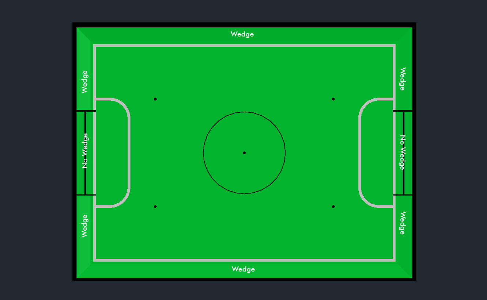

= Technical Specification For Soccer Fields
{docdate}
:toc: left
:sectanchors:
:sectlinks:
:xrefstyle: full
:section-refsig: Rule
:sectnums:

ifdef::basebackend-html[]
++++
<link rel="stylesheet" href="https://use.fontawesome.com/releases/v5.3.1/css/all.css" integrity="sha384-mzrmE5qonljUremFsqc01SB46JvROS7bZs3IO2EmfFsd15uHvIt+Y8vEf7N7fWAU" crossorigin="anonymous">

++++
endif::basebackend-html[]

:icons: font
:numbered:

[[dimensions-of-the-field]]
== Dimensions of the field

The playing field is 158 cm by 219 cm. The field is
marked by a white line which is part of the playing field. Around the
playing field, beyond the white line, there is an outer area
of 12 cm in width.

The floor near the exterior wall includes a wedge, which is an incline with a
10 cm base and 2 +/- 1 cm rise for allowing the ball to roll back into play
when it leaves the playing field. Note that the goal should not contain the
wedge.

Total dimensions of the field, including the outer area, are 182 cm by 243 cm.

[[field-walls]]
== Walls

Walls are placed all around the field, including behind the goals and the
out-area. The height of the walls is 22 cm. The walls are painted matte black.

[[goals]]
== Goals

The field has two goals, centered on each of the shorter sides of the playing
field. The goal inner space is 60 cm wide, 10 cm high and 74 mm deep, box
shaped.

The goal "posts" are positioned over the white line marking the limits of the
field.

The interior walls and of each goal are colored matte, one goal yellow and the
other goal blue. It is recommended that the blue be of a brighter shade so that
it is different enough from the black exterior.

[[floor]]
== Floor

The floor
consists of green carpet ideally of darker shade on top of a hard level surface. Teams
should be prepared to adjust to different levels of contrast between the green carpet
and lines as some events may be restricted to using lighter shades of green. All
lines on the field should be painted, marked with tape,
or installed as white carpet and be somewhat resistant to tearing or ripping.
Lines should have a width of 20mm (±10%).

It is impractical to set international constraints on carpet other than it
being green. In the spirit of the competition, teams should design robots
to be tolerant or adaptable to different fibers, textures, construction,
density, shades, and designs of carpet especially when competing amongst different
regions. Teams are encouraged to visit regional resources or reach out to Local
Organization Committee for suggestions if desiring to build their own practice
field(s).

[[neutral-spots]]
== Neutral spots

There are five neutral spots defined in the field. One is in the center of the
field. The other four are adjacent to each corner, located 45 cm
along the long edge of the field. They align with the sides of the penalty
areas. The neutral spots can be drawn with a thin black marker.
The neutral spots ought to be of circular shape measuring 1 cm in diameter.

[[center-circle]]
== Center circle

A center circle will be drawn on the field. It is 60 cm in diameter. It is a
thin black marker line. It is there as guidance during kick-off.

[[penalty-areas]]
== Penalty areas

In front of each goal there is a 25 cm wide and 80 cm long penalty
area with rounded front corners (15cm radius).

The penalty areas are marked by a white line of 20 mm (±10%) width. The
line is part of the area.

[[lighting-and-magnetic-conditions]]
== Lighting and Magnetic Conditions

The tournament organizers will do their best to limit the amount of external lightning and
magnetic interference. However, the robots need to be constructed in a way
which allows them to work in conditions that are not perfect (i.e. by not
relying on compass sensors or specific lightning conditions).

[discrete]
[[field-diagrams]]
== FIELD DIAGRAMS

[.text-center]

[.text-center]
image:media/SoccerFieldDrawings.png[image,width=18.0%]

== Field CAD models

There are STEP and IGES files available that contain a model of the fields.
These are _not authorithative_ and exist mostly for illustration purposes.
footnote:[they can be found at 
https://github.com/robocup-junior/soccer-rules/tree/master/media/CAD]

== Notes on building soccer fields

There is *no standard design&* for fields - some notes from experience are
collected below. If you have any questions don't hesitate to ask on the usual
channels (Discord, Forum, Email, all listed in the main rules)

=== Getting your first field - starting small

If you are a team, school etc. just getting started with RoboCupJunior Soccer
you can start with something much simpler and cheaper than a competition-grade
field: Get yourself some green carpet and some white tape for the lines and
make a basic field you can put on the ground. The next upgrade could be some
walls (maybe you have some cardboard or scrap wood that you can spray paint
black and put up in a square shape). If you grow out of that it might be
time to build actual full fields. There are designs that can be stowed
relatively easily (by folding in half or being taken apart into quarters),
more on that below.

=== Converting existing equipment (esp. for Entry Leagues)

// TODO: Put link for Entry details
If you are considering starting in one of the Entry Leagues and you or your
school have existing fields of any kind (e.g. First Lego League fields can
be converted to competition-spec entry fields by just laying down carpet and
installing goals. The Entry rules explicitly have a size range so that
different size existing equipment can be used.

=== Building Competition Fields

If you are hosting a competition you are probably in one of three situations:

- You build fields that you will be using for practice and then maybe
put on fresh carpet when you use them for the competition. Many local
competitions that get hosted by schools that also participate work this way.
- You are building fields that you have no immediate use for after the
big competition you're involved with hosting. In that case consider building
fields that are suitable (i.e. durable, transportable and storable) to be
given out to local/regional competition hosts or participating schools
 in the region to support RoboCupJunior instead of going to waste.
- You are using fields you already have.

It may of course also be a combination of these cases or something else
entirely. 

=== Competition conditions

If you are hosting competitions it is worth it to make sure all
carpets use the same material, all walls and goals use the same surface finish
(so no matte/shiny differences between fields, no color shade differences
between the goals and so on). Teams greatly appreciate this because it makes
their calibration work a lot better. This also applies to having even lighting.
As little natural light as possible (because it tends to change a lot) and 
placement of the fields in such a way that there is a similar amount of light
(smartphones can measure this well) and as little shadow as possible on the
fields).

If you plan to use your fields for an extended period of time avoid fiberboard
(MDF etc.). Qualify plywood works really well but is expensive - so investing
in that once you have worn out a cheap field may be an option.  Robot impacts
into walls and goals have gone down a lot with rule changes of 2022-2024 but
we've had goals torn out of fields in the past. Assembling and disassembling
fields (which you may have to do if you have limited space and have to store
them when not in use or if you have to transport them to a location to host
a regular tournament) also puts wear and tear on the fields and using locking
fasteners where a thread or similar 