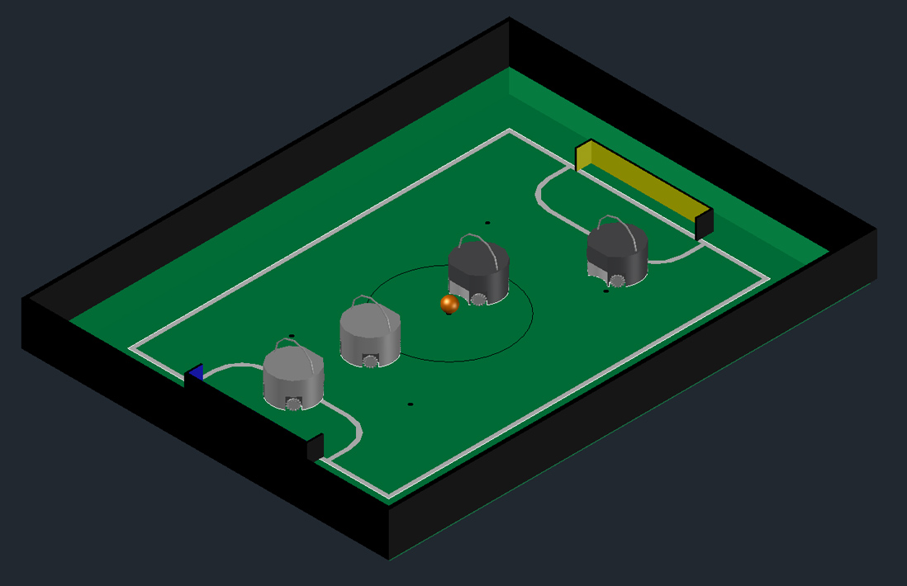
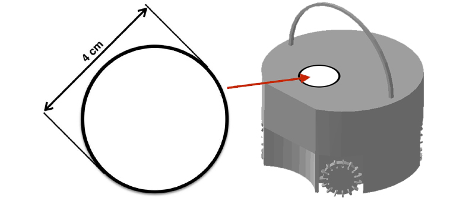
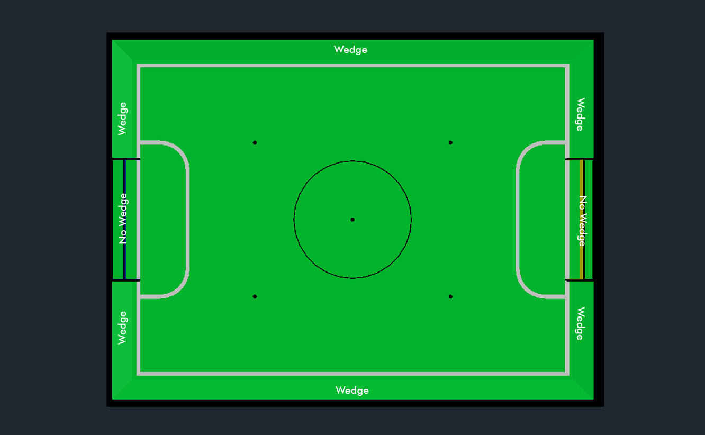

= RoboCupJunior Soccer Rules 2023
{docdate}
:toc: left
:sectanchors:
:sectlinks:
:xrefstyle: full
:section-refsig: Rule
:sectnums:

ifdef::basebackend-html[]
++++
<link rel="stylesheet" href="https://use.fontawesome.com/releases/v5.3.1/css/all.css" integrity="sha384-mzrmE5qonljUremFsqc01SB46JvROS7bZs3IO2EmfFsd15uHvIt+Y8vEf7N7fWAU" crossorigin="anonymous">

++++
endif::basebackend-html[]

:icons: font
:numbered:

//TODO: revert to official Soccer rules for final release
These are the official Soccer rules for RoboCupJunior 2023. They are released
by the RoboCupJunior Soccer League Committee. The English version of these
rules has priority over any translations.

Teams are advised to check the RoboCupJunior Soccer site
https://junior.forum.robocup.org/ for procedures and requirements for the
international competition and with local tournament organizers for local,
regional and super-regional competitions. Each team is responsible
for verifying the latest version of the rules prior to competition. {++Teams
should ask for clarifications on the Forum where necessary.++}
footnote:[The current version of these rules can be found at
https://robocupjuniortc.github.io/soccer-rules/master/rules.html in HTML form
and at https://robocupjuniortc.github.io/soccer-rules/master/rules.pdf in PDF
form.]

[title="Two teams of two robots with an orange ball on a RoboCupJunior Soccer field."]

[discrete]
== Preface

In the RoboCupJunior Soccer challenge, teams of young engineers design, build,
and program two fully autonomous mobile robots to compete against another team
in matches. The robots must detect a ball and score into a color-coded goal on
a special field that resembles a human soccer field.

To be successful, participants must demonstrate skill in programming, robotics,
electronics and mechatronics. Teams are also expected to contribute to the
advancement of the community as a whole by sharing their discoveries with other
participants and by engaging in good sportsmanship, regardless of culture, age
or result in the competition. *All are expected to compete, learn, have fun, and grow.*

RoboCupJunior Soccer consist of two sub-leagues: *Soccer Open* and *Soccer
Lightweight*. These rules apply for both sub-leagues. There are two main
differences between the two leagues.

* *Soccer Lightweight* is played using a special ball that emits an IR
signal ball. Robots may weigh up to 1.1 kg, may have a ball-capturing zone of
up to 3.0 cm, and may use batteries up to 12.0 V nominal voltage.

* *Soccer Open* is played using a passive, brightly colored orange
ball. Robots may weigh up to 2.2 kg, may have a ball-capturing zone of up to
1.5 cm, and may use batteries up to 15.0 V nominal voltage.

Please see <<ball>> for ball specifications and <<league-regulations>> for
more details for specifications/regulations.

_If you would like to start with RoboCupJunior Soccer, please contact the
organizer of your regional RoboCupJunior competition and ask them about_ <<entry-league>>.

Unless specified otherwise, all parts of these rules are released under the
terms of the Creative Commons Attribution-ShareAlike License.

[discrete]
=== Changes from the 2022 RoboCupJunior Soccer Rules

The rule changes developed by the Soccer League Committee in cooperation with the
RoboCup Junior Soccer Community (please continue to post ideas for the future on
the forum any time) aim to improve general gameplay by reducing lack of progress
and out of reach situations (increased playing area size) and for Open League easing
optics requirements and permitting more kicker power.

Detailed changes are listed below and link to the corresponding place in the rule.

{+-~TOC-CHANGES~-+}

[discrete]
=== Construction and Programming have to be performed exclusively by the students

Robots must be constructed and programmed exclusively by student members of the
team. Mentors, teachers, parents or companies should not be involved in the
design, construction, assembly, programming or debugging of robots. To avoid
possible disqualification, it is extremely important that
teams abide by <<league-regulations>>, especially <<regulations-construction>>
and <<regulations-programming>>, and all other competitor’s rules.

If in doubt, please consult with your Regional Representative before
registering your team.

[[gameplay]]
== GAMEPLAY

[[game-procedure-and-length-of-a-game]]
=== Game procedure and length of a game

RCJ Soccer games consist of two teams of robots playing soccer against each
other. Each team has two autonomous robots. The game will consist of two
halves. The duration of each half is 10-minutes. There will be a 5-minute break
in between the halves.

The game clock will run for the duration of the halves without stopping (except
when a referee wants to consult another official). The game clock will be
run by a referee or a referee assistant (see <<referee-and-referee-assistant>>
for more information on their roles).

Teams are expected to be at the field 5 minutes before their game starts. Being
at the inspection table does not count in favor of this time limit. Teams that
are late for the start of the game may be penalized one goal *per 30 seconds*
at the referee’s discretion.

The final game score will be trimmed so that there is at most 10-goal
difference between the losing and the winning team.

[[pre-match-meeting]]
=== Pre-match meeting

At the start of the first half of the game, a referee will toss a coin. The
team mentioned first in the draw shall call the coin. The winner of the toss
can choose either which end to kick towards, or to kick off first. The loser of
the toss chooses the other option. After the first half, teams switch sides.
The team not kicking off in the first half of the game will kick off to begin
the second half of the game.

During the pre-match meeting the referee or their assistant may check whether
the robots are capable of playing (i.e., whether they are at least able to
follow and react to the ball). If none of the robots is capable of playing, the
game will not be played and zero goals will be awarded to both teams.

[[kick-off]]
=== Kick-off

Each half of the game begins with a kick-off. All robots must be located on
their own side of the field. All robots must be halted. The ball is positioned
by a referee in the center of the field.

The team kicking off places their robots on the field first.

The team not kicking off will now place their robots on the defensive end of
the field. All robots on the team not kicking off must be at least 30 cm away
from the ball (outside of the center circle).

Robots cannot be placed out of bounds. Robots cannot be repositioned once they
have been placed, except if the referee requests to adjust their placement to
make sure that the robots are placed properly within the field positions.

On the referee’s command (usually by whistle), all robots will be started
immediately by each captain. Any robots that are started early will be removed
by the referee from the field and deemed damaged.

Before a kick-off, *all damaged or out-of-bounds robots* are allowed to return to
the playing field immediately if they are _ready and fully functional_.

If no robots are present at a kick-off (because they have moved out-of-bounds
<<out-of-bounds>> or are damaged <<damaged-robots>>), the penalties are
discarded and the match resumes with a <<neutral-kickoff>>.

[[neutral-kickoff]]
==== Neutral kick-off

A neutral kick-off is the same as the one described in <<kick-off>> with a
small change: all robots must be at least 30 cm away from the ball
(outside of the center circle).

[[human-interference]]
=== Human interference

Except for the kick-off, human interference from the teams (e.g. touching the
robots) during the game is not allowed unless explicitly permitted by a
referee. Violating team(s)/team member(s) may be disqualified from the game.

The referee or a referee assistant can help robots get unstuck if the ball is
not being disputed near them and if the situation was created from normal
interaction between robots (i.e. it was not a design or programming flaw of the
robot alone). The referee or a referee assistant will pull back the robots just
enough for them to be able to move freely again.

[[ball-movement]]
=== Ball movement

A robot cannot hold a ball. Holding a ball is defined as taking full control of
the ball by removing all of degrees of freedom. Examples for ball holding
include fixing a ball to the robot’s body, surrounding a ball using the robot’s
body to prevent access by others, encircling the ball or somehow trapping the
ball with any part of the robot’s body. If a ball does not roll while a robot
is moving, it is a good indication that the ball is trapped.

The only exception to holding is the use of a rotating drum (a "dribbler") that
imparts dynamic back spin on the ball to keep the ball on its surface.

Other players must be able to access the ball.

{++The ball needs to stay within the bounds of the field, as defined by the
walls. If a robot moves the ball outside of the field (that is, beyond the walls
or above their height), it is deemed damaged. (<<damaged-robots>>)++}

[[scoring]]
=== Scoring

A goal is scored when the ball strikes or touches the back wall of the goal.
Goals scored by any robot have the same end result: they give one goal to the
team on the opposite side. After a goal, the game will be restarted with a
kick-off from the team who was scored against.

[[inside-penalty-area]]
=== Inside the Penalty Area

No robots are allowed to be fully inside the penalty area. As the penalty
areas are marked with a white line, the Out of Bounds and Out of Reach rules
apply as well. (<<out-of-bounds>>)

If two robots from the same team are at least partially in a penalty area,
the robot further from the ball will be moved to the _furthest unoccupied
neutral spot_ immediately. If this happens repeatedly, a robot may be deemed
damaged at referee's discretion. (<<damaged-robots>>)

If an attacking and a defending robot touch each other while at least one of
them is at least partially inside the penalty area, and at least one of them
has physical contact with the ball, this may be called "pushing" at the
referee's discretion. In this case, the ball will be moved to the _furthest
unoccupied neutral spot_ immediately.

If a goal is scored as a result of a "pushing" situation, it will not be
granted.

[[lack-of-progress]]
=== Lack of progress

Lack of progress occurs if there is no progress in the gameplay for a
reasonable period of time and the situation is not likely to change. Typical
lack of progress situations are when the ball is stuck between robots, when
there is no change in ball and robot’s positions, or when the ball is beyond
detection or reach capability of all robots on the field.

After a visible and loud count footnote:[usually a count of three],
a referee will call `*lack of progress*` and
will move the ball to the nearest unoccupied neutral spot. If this does not
solve the lack of progress, the referee can move the ball to a different
neutral spot.

[[out-of-bounds]]
=== Out of bounds

{~~If a robot’s entire body moves out beyond the white line of the field, it
will~>If a robot touches a wall or moves completely into the penalty area it
will~~} be called for being `*out of bounds*`. When this situation arises, the
robot is given a one-minute penalty, and the team is asked to remove the robot
from the field. There is no time stoppage for the game itself. The robot is
allowed to return if a kick-off occurs before the penalty has elapsed.

The one-minute penalty starts when the robot is removed from play.
Furthermore, any goal scored by the penalized team while the penalized robot is
on the field will not be granted. Out-of-bounds robots can be fixed if the team
needs to do so, as described in <<damaged-robots>>.

After the penalty time has passed, robot will be placed on the unoccupied
neutral spot furthest from the ball, facing its own goal.

A referee can waive the penalty if the robot was accidentally pushed out of
bounds by an opposing robot. In such a case, the referee may have to slightly
push the robot back onto the field.

The ball can leave and bounce back into the playing field. The referee calls
`*out of reach*`, and will move the ball to the nearest unoccupied neutral spot
when one of the following conditions occurs:

1. the ball remains outside the playing field too long, after a visible and
loud count footnote:[usually a count of three],

2. any of the robots are unable to return it into the playing field (without
their whole body leaving the playing field), or

3. the referee determines that the ball will not come back into the playing
field.

[[damaged-robots]]
=== Damaged robots

If a robot is damaged, it has to be taken off the field and must be fixed
before it can play again. Even if repaired, the robot must remain off the field
for at least one minute or until the next kick-off is due.

Some examples of a damaged robot include:

* it does not respond to the ball, or is unable to move (it lost pieces,
power, etc.).
* it continually moves into the penalty area or out of bounds.
* it turns over on its own accord.

Computers and repair equipment are not permitted in the playing area during
gameplay. Usually, a team member will need to take the damaged robot to an
"approved repair table" near the playing area. A referee may permit robot
sensor calibration, computers and other tools in the playing area, only for the
5 minutes before the start of each half.

After a robot has been fixed, it will be placed on the unoccupied neutral spot
furthest from the ball, facing its own goal. A robot can only be returned to
the field if the damage has been repaired. If the referee notices that the
robot was returned to the field with the same original problem, they may ask
the robot to be removed and proceed with the game as if the robot had not been
returned.

*Only the referee decides whether a robot is damaged.* A robot can only be
taken off or returned with the referee’s permission.

If both robots from the same team are deemed damaged at kick-off, gameplay will
be paused and the remaining team will be awarded 1 goal for each elapsed 30
seconds that their opponent’s robots remain damaged. However, these rules only
apply when none of the two robots from the same team were damaged as the result
of the opponent team violating the rules.

Whenever a robot is removed from play, its motors must be turned off.

[[interruption-of-game-ref-interruption]]
=== Interruption of Game

In principle, a game will not be stopped.

A referee can stop the game if there is a situation on or around the field
which the referee wants to discuss with an official of the tournament or if the
ball malfunctions and a replacement is not readily available.

When the referee has stopped the game, all robots must be stopped and remain on
the field untouched. The referee may decide whether the game will be
continued/resumed from the situation in which the game was stopped or by a
kick-off.

[[team]]
== TEAM

[[team-regulations]]
=== Regulations

A team must have more than one member to form a RoboCupJunior team to
participate in the international competition. Team member(s) and/or robot(s) cannot
be shared between teams.

Each team member needs to carry a technical role.

Each team must have a *captain*. The captain is the person responsible
for communication with referees. The team can replace its captain
with another team member during
the competition. Each team is allowed to have at most two members beside the
field during gameplay: they will usually be the captain and an
assistant team member.

[[team-violations]]
=== Violations

Teams that do not abide by the rules are not allowed to participate.

{~~Any person close to the playing field is not allowed to wear any orange, yellow
or blue clothes that can be seen by the robots (to avoid interference). A
referee can require a team member to change clothes or to be replaced by
another team member if interference is suspected.~>Robots are expected to be
capable of dealing with any colors above the walls (e.g. blue, yellow,
green or orange shirts) either in hardware (e.g. limiting the field of view from looking up) or
in software (e.g. masking the input image).~~}

The referee can interrupt a game in progress if any kind of interference from
spectators is suspected (IR emitters, camera flashes, mobile
phones, radios, computers, etc.).

This needs to be confirmed by the tournament organizers if a claim is placed by the other
team. A team claiming that their robot is affected by colors has to show the
proof/evidence of the interference.

[[robots]]
== ROBOTS

[[number-of-robots-substitution]]
=== Number of robots / substitutions

Each team is allowed to have at most two robots for the full tournament.
The substitution of robots during the competition within the team or
with other teams is forbidden.

[[robots-interference]]
=== Interference

Robots are not allowed to be colored orange, yellow or blue in order to avoid
interference. Orange, yellow, blue colored parts used in the construction of
the robot must either be occluded by other parts from the perception by other
robots or be taped/painted with a neutral color.

Robots must not produce magnetic interference in other robots on the field.

Robots must not produce visible light that may prevent the opposing team from
playing when placed on a flat surface. Any part of a robot that produces light
that may interfere with the opposing robot’s vision system must be covered.
For Lightweight-specific regulations see <<regulations-inference-in-lightweight>>

A team claiming that their robot is affected by the other team’s robot in any
way must show the proof/evidence of the interference. Any interference needs to
be confirmed by the tournament organizers if a claim is placed by the other team.

[[robots-control]]
=== Control

The use of remote control of any kind is not allowed during the match. Robots
must be started and stopped manually by humans and be controlled autonomously.

[[communication]]
=== Communication

Robots are not allowed to use any kind of communication during gameplay unless
the communication between robots is via Bluetooth class 2 or class 3
footnote:[range shorter than 20 meters] or via any other device that
communicates using the 802.15.4 protocol (e.g., ZigBee and XBee).

Teams are responsible for their communication. The availability of frequencies
cannot be guaranteed.

[[agility]]
=== Agility

Robots must be constructed and programmed in a way that their movement is not
limited to only one dimension (defined as a single axis, such as only moving in
a straight line). They must move in all directions, for example by turning.

Robots must respond to the ball in a direct forward movement towards it. For
example, it is not enough to basically just move left and right in front of
their own goal, it must also move directly towards the ball in a forward
movement. At least one team robot must be able to seek and approach the ball
anywhere on the field, unless the team has only one robot on the field at that
time.

A robot must touch the ball that is placed no further than 20 cm from any point
on its convex hull within 10 seconds. If a robot does not do so within the time
limit, it is deemed to be damaged. (See <<damaged-robots, Damaged Robots>>.)

[[handle]]
=== Handle

All robots must have a stable and easily noticeable handle to hold and to lift
them. The handle must be easily accessible and allow the robot to be picked up
from at least 5 cm above the highest structure of the robot.

The dimensions of the handle may exceed the robot height
limitation, but the part of the handle that exceeds this
limit cannot be used to mount components of the robot.

[[top-markers]]
=== Top Markers

A robot must have markings in order to be distinguished by the referee. Each
robot must have a white plastic circle with a diameter of at least 4 cm mounted
horizontally on top. This white circle will be used by the referee to write
numbers on the robots using markers, therefore the white circles must be
accessible and visible.

Before the game, the referee will designate the numbers for each robot and will
write them on the top white circle. Robots not carrying the top white circle
are not eligible to play.

.A visualization of the top marker

[[additional-regulations-of-the-sub-leagues]]
=== Additional regulations of the sub-leagues

A tournament may be organized in different sub-leagues. Each sub-league (e.g.
*Soccer Open* and *Soccer Lightweight*) has its own additional regulations,
including regulations affecting the construction of robots. They are outlined
in <<league-regulations>>.

[[violations]]
=== Violations

Robots that do not abide by the specifications/regulations (see
<<regulations>>) are not allowed to play, unless these rules specify otherwise.

If violations are detected during a running game the team may be disqualified for
that game.

If similar violations occur repeatedly, the team may be disqualified from the
tournament.

[[field]]
== FIELD

[[dimensions-of-the-field]]
=== Dimensions of the field

The playing field is {~~132 cm by 193 cm~>158 cm by 219 cm~~}. The field is
marked by a white line which is part of the playing field. Around the
playing field, beyond the white line, there is an outer area
of {~~25 cm in width~>12 cm in width~~}.

The floor near the exterior wall includes a wedge, which is an incline with a
10 cm base and 2 +/- 1 cm rise for allowing the ball to roll back into play
when it leaves the playing field.

Total dimensions of the field, including the outer area, are 182 cm by 243 cm.

[[field-walls]]
=== Walls

Walls are placed all around the field, including behind the goals and the
out-area. The height of the walls is 22 cm. The walls are painted matte black.

[[goals]]
=== Goals

The field has two goals, centered on each of the shorter sides of the playing
field. The goal inner space is 60 cm wide, 10 cm high and 74 mm deep, box
shaped.

The goal "posts" are positioned over the white line marking the limits of the
field.

The interior walls and of each goal are colored matte, one goal yellow and the
other goal blue. It is recommended that the blue be of a brighter shade so that
it is different enough from the black exterior.

[[floor]]
=== Floor

{~~The floor consists of dark green carpet on top of a hard level surface~>The floor
consists of green carpet ideally of darker shade on top of a hard level surface. Teams
should be prepared to adjust to different levels of contrast between the green carpet
and lines as some events may be restricted to using lighter shades of green~~}  All
{~~straight lines~>lines~~} on the field should be {~~painted~>painted, marked with tape,
or installed as white carpet and be somewhat resistant to tearing or ripping.~~}
{~~and have a width of 20 mm.~>Lines should have a width of 20mm (±10%).~~}

It is impractical to set international constraints on carpet other than it
being {~~dark green~>green~~}. In the spirit of the competition, teams should design robots
to be tolerant or adaptable to different fibers, textures, construction,
density, {~~and~>shades, and~~} designs of carpet especially when competing amongst different
regions. Teams are encouraged to visit regional resources or reach out to Local
Organization Committee for suggestions if desiring to build their own practice
field(s).

[[neutral-spots]]
=== Neutral spots

There are five neutral spots defined in the field. One is in the center of the
field. {~~The other four are adjacent to each corner, located 45 cm along the long
edge of the field, aligned with each goal post towards the middle of the field
(from the goal post)~>The other four are adjacent to each corner, located 45 cm
along the long edge of the field. They align with the sides of the penalty
areas.~~}. The neutral spots can be drawn with a thin black marker.
The neutral spots ought to be of circular shape measuring 1 cm in diameter.

[[center-circle]]
=== Center circle

A center circle will be drawn on the field. It is 60 cm in diameter. It is a
thin black marker line. It is there for Referees and Captains as guidance
during kick-off.

[[penalty-areas]]
=== Penalty areas

In front of each goal there is a 25 cm wide and {~~70 cm long~>80 cm long~~} penalty
area with rounded front corners (15cm radius).

The penalty areas are marked by a white line of 20 mm (±10%) width. The
line is part of the area.

[[lighting-and-magnetic-conditions]]
=== Lighting and Magnetic Conditions

The tournament organizers will do their best to limit the amount of external lightning and
magnetic interference. However, the robots need to be constructed in a way
which allows them to work in conditions that are not perfect (i.e. by not
relying on compass sensors or specific lightning conditions).

[discrete]
[[field-diagrams]]
== FIELD DIAGRAMS

image:media/SoccerFieldDrawings.png[image,scaledwidth=90.0%]

[[ball]]
== BALL

[[specification-for-soccer-lightweight-ball]]
=== Specification for Soccer Lightweight Ball

See <<technical-specification-for-pulsed-soccer-ball>>.

[[specification-for-soccer-open-ball]]
=== Specification for Soccer Open Ball

See <<passive-ball-spec>>.

[[tournament-balls]]
=== Tournament balls

Balls for the tournament must be made available by the tournament organizers.
Tournament organizers are not responsible for providing balls for practice.

[[code-of-conduct]]
== CODE OF CONDUCT

[[fair-play]]
=== Fair Play

It is expected that the aim of all teams is to play a fair and clean game of
robot soccer. It is expected that all robots will be built with consideration
to other participants.

Robots are not allowed to cause deliberate interference with or damage to other
robots during normal gameplay.

Robots are not allowed to cause damage to the field or to the ball during
normal gameplay.

A robot that causes damage may be disqualified from a specific match at the
tournament organizer's discretion.

Humans are not allowed to cause deliberate interference with robots or damage
to the field or the ball.

[[behavior]]
=== Behavior

All participants are expected to behave themselves. All movement and behavior
is to be of a subdued nature within the tournament venue.

[[help]]
=== Help

Mentors (teachers, parents, chaperones, and other adult team-members including
translators) are not allowed in the student work area unless it is explicitly
but temporarily permitted by tournament organizers. Only
participating students are allowed to be inside the work area.

*Mentors must not touch, build, repair, or program any robots.*

[[sharing]]
=== Sharing

The understanding that any technological and curricular developments should be
shared among the RoboCup and RoboCupJunior participants after the tournament
has been a part of world RoboCup competitions.

[[spirit]]
=== Spirit

It is expected that all participants, students, mentors, and parents will
respect the RoboCupJunior mission.

*_It is not whether you win or lose, but how much you learn that counts!_*

[[violations-disqualification]]
=== Violations / Disqualification

Teams that violate the code of conduct may be disqualified from the tournament.
It is also possible to disqualify only single person or single robot from
further participation in the tournament.

In less severe cases of violations of the code of conduct, a team will be given
a warning. In severe or repeated cases of
violations of the code of conduct a team may be disqualified immediately
without a warning.

[[conflict-resolution]]
== CONFLICT RESOLUTION

[[referee-and-referee-assistant]]
=== Referee and referee assistant

The referee is a person in charge of making decisions with regards to the game,
according to these rules, and may be assisted by a referee assistant.

*During gameplay, the decisions made by the referee and/or the referee
assistant are final.*

Any argument with the referee or the referee assistant can result in a warning.
If the argument continues or another argument occurs, this may result in
immediate disqualification from the game.

Only the captain has a mandate to freely speak to the referee and/or their
assistant. Shouting at a referee and/or their assistant, as well as demanding a
change in ruling may be penalized by a warning at the referee’s
discretion.

At the conclusion of the game, the result recorded in the scoresheet is final.
The referee will ask the captains to add written comments to the scoresheet if
they consider them necessary. These comments will be reviewed by the tournament
organizers.

[[rule-clarification]]
=== Rule clarification

Rule clarification may be made by members of the tournament organizers
and the Soccer League Committee, if necessary even during a tournament.

[[rule-modification]]
=== Rule modification

If special circumstances, such as unforeseen problems or capabilities of a
robot occur, rules may be modified by the tournament organizers, if
necessary even during a tournament.

[[regulatory-statutes]]
=== Regulatory statutes

Each RoboCupJunior competition may have its own regulatory statutes to define
the procedure of the tournament (for example the SuperTeam system, game modes,
the inspection of robots, interviews, schedules, etc.). Regulatory statutes
become a part of this rule.

[[league-regulations]]
== LEAGUE REGULATIONS

[[league-regulations-preamble]]
=== Preamble

According to rule 3.8 of the RoboCupJunior Soccer Rules, each league has its
own additional regulations. They become a part of the rules.

For RoboCupJunior , there are two sub-leagues as follows
footnote:[biggest differences are described in <<dimensions>>]:

* Soccer Lightweight
* Soccer Open

All team members need to be within the age range specified in
the RoboCupJunior General Rules which can be found at
http://junior.robocup.org/robocupjunior-general-rules/.

As described in <<specification-for-soccer-lightweight-ball>> and
<<specification-for-soccer-open-ball>>, the matches in the Soccer Open
sub-league are conducted using a passive ball, whereas the matches in the
Soccer Lightweight sub-league are played using the IR ball.

[[regulations]]
=== Regulations

[[dimensions]]
==== Dimensions

Robots will be measured in an upright position with all parts extended. A
robot’s dimensions must not exceed the following limits:

|===
|sub-league | *Soccer* *Open* | *Soccer Lightweight*
|size ^[0]^  | 18.0 cm | 22.0 cm +
|height | 18.0 cm ^[1]^ | 22.0 cm ^[1]^ +
|weight | 2200 g ^[2]^ | 1100 g ^[2]^ +
|ball-capturing zone | 1.5 cm | 3.0 cm +
|voltage | 15.0 V ^[3]^ ^[4]^ | 12.0 V ^[3]^ ^[4]^ +
|===

TIP: [0] Robot must fit {++smoothly++} into a cylinder of this diameter

TIP: [1] The handle and the top markers of a robot may exceed the height.

TIP: [2] The weight of the robot includes that of the handle.

IMPORTANT: [3] We *strongly* encourage teams to include protection circuits for Lithium-based
batteries

NOTE: [4] Voltage limits relate to the *nominal values*, deviations at the
power pack due to the fact that charged will be tolerated.

Ball-capturing zone is defined as any internal space created when a straight
edge is placed on the protruding points of a robot. This means the ball must
not enter the convex hull of a robot by more than the specified depth.
Furthermore, it must be possible for another robot to take possession of the
ball.

[[regulations-inference-in-lightweight]]
==== Infrared interference in Lightweight

{~~In Lightweight, the robot must not emit infrared light.~>Components designed
to emit IR (e.g. ToF, LiDAR, IR distance sensors, IR LEDs/LASERs etc.) are not
allowed and tournament organizers will require such devices to be removed or
covered up.~~}

In Lightweight, infrared light reflecting materials must not be visible.
If robots are painted, they must be painted matte. Minor parts that
reflect infrared light could be used as long as other robots are not affected.

[[regulations-limitations]]
==== Limitations

{~~A single robot can only use one camera. All commercial omnidirectional
lenses/cameras are not permitted. Only omnidirectional lenses/cameras made by
students are permitted, meaning that their construction needs to be primarily
and substantially the original work of a team. Teams using them on their robots
must prove how they made them on their presentation poster and at an interview.
For the purpose of these rules omnidirectional is defined as having a
field-of-view of more than 140 degrees horizontally and more than 80 degrees
vertically (these values reflect the optical system of the human eye).~>A
robot may use any number of cameras without restrictions on lenses,
optical parts, optical systems, and total field of view. Components may be
sourced in any way the team sees fit.~~}

Voltage pump circuits are permitted only for a kicker drive. {++No voltage may
exceed 48V at any time and maximum boost voltage must be available for
demonstration and measurement at inspections. When not in use measurement
contacts must be protected from accidental touches or short circuits.++} All
other
electrical circuits inside the robot cannot exceed 15.0 V for Soccer Open and
12.0 V for Soccer Lightweight. Each robot must be designed to allow verifying
the voltage of power packs and its circuits, unless the nominal voltage is
obvious by looking at the robot, its power packs and connections.

Pneumatic devices are allowed to use ambient air only.

Kicker strength is subject to compliance check at any time during the
competition. During gameplay, a referee can ask to see a sample kick on the
field before each half when a damaged robot is returned to the field or when
the game is about to be restarted after a goal. If the referee strongly
suspects that a kicker exceeds the power limit, they can require an official
measurement. See <<kicker-power-measuring>> for more details.

[[regulations-construction]]
==== Construction

IMPORTANT: Robots must be constructed exclusively by the student members of a
team. Mentors, teachers, parents or companies may not be involved in the
design, construction, and assembly of robots.

For the construction of a robot, any robot kit or building block may be used as
long as the design and construction are primarily and substantially the
original work of a team. This means that commercial kits may be used but must
be substantially modified by the team. It is neither allowed to mainly follow a
construction manual, nor to just change unimportant parts.

Indications for violations are the use of commercial kits that can basically
only be assembled in one way or the fact that robots from different team(s),
build from the same commercial kit, all basically look or function the same.

Robots must be constructed in a way that they can be started by the captain
without the help of another person.

Since a contact with an opponent robot and/or dribbler that might damage some
parts of robots cannot be fully anticipated, *robots must have all its active
elements properly protected with resistant materials*. For example, electrical
circuits and pneumatic devices, such as pipelines and bottles, must be
protected from all human contact and direct contact with other robots.

IMPORTANT: All driven dribbler gears must be covered with metal or hard plastic.

When batteries are transported or moved, it is *strongly* recommended that safety bags be
used. Reasonable efforts should be made to make sure that in all circumstances
robots avoid short-circuits and chemical or air leaks.

IMPORTANT: The use of swollen, tattered or otherwise dangerous battery is not
allowed.

[[regulations-programming]]
==== Programming

Robots must be programmed exclusively by student members of the team. Mentors,
teachers, parents or companies should not be involved in the programming and
debugging of robots.

For the programming of the robots, any programming language, interface or
integrated development environment (IDE) may be used. The use of programs that
come together with a commercial kit (especially sample programs or presets) or
substantial parts of such programs are not allowed. It is not allowed to use
sample programs, not even if they are modified.

[[regulations-inspections]]
==== Inspections

Robots must be inspected and certified every day before the first game is
played. The tournament organizers may request other inspections if necessary,
including random inspections which may happen at any time. The routine
inspections include:

* Weight restrictions for the particular sub-league (see <<dimensions>>).
* Robot dimensions (see <<dimensions>>).
* Voltage restrictions (see <<dimensions>> and <<regulations-limitations>>).
* Kicker strength limits, if the robot has a kicker (see <<kicker-power-measuring>>).

Proof must be provided by each team that its robots comply with these
regulations, for example, by a detailed documentation or logbook. Teams may be
interviewed about their robots and the development process at any time during a
tournament.

[[international-competition]]
== INTERNATIONAL COMPETITION

[[international-competition-team]]
=== Team

Maximum team size is 4 members for RoboCupJunior Soccer.

Soccer Lightweight team members can participate in the World
Championship only twice. After their second participation, they need to move to
Soccer Open.

[[interviews]]
=== Interviews

During the international competition, the tournament organizers will arrange to
interview teams during the Setup Day of the event. This means that the teams
need to be already present early on this day. Teams must bring robots, the code
that is used to program them and any documentation to the interview.

During an interview, at least one member from each team must be able to explain
particularities about the team’s robots, especially with regards to its
construction and its programming. An interviewer may ask the team for a
demonstration. The interviewer may also ask the team to write a simple program
during the interview to verify that the team is able to program its robot.

All teams are expected to be able to conduct the interview in English. If this
poses a problem, the team may ask for a translator to be present at the
interview. If the tournament organizers are not able to provide a translator, the team is required
to do so. During the interview, the team will be evaluated using so called
Rubrics, which are published on the website mentioned in the beginning of these
rules.

The Soccer League Committee recommends the implementation of interviews in regional
competitions as well, but this is not mandatory.

[[technical-challenges]]
=== Technical Challenges

Inspired by the major leagues and the need for further technological
advancement of the leagues, the Soccer League Committee has decided to introduce so
called *Technical Challenges*.

The idea of these challenges is to give the teams an opportunity to show off
various abilities of their robots which may not get noticed during the regular
games. Furthermore, the Soccer League Committee envisions these challenges to be a
place for testing new ideas that may make it to the future rules, or otherwise
shape the competition.

Any RoboCupJunior Soccer team will be eligible to try to tackle these
challenges. Unless otherwise stated, any robot taking part in these challenges
needs to abide by these rules in order to successfully complete it.

[[precision-shooter]]
==== Precision shooter

_The results in soccer are evaluated by the number of scored goals. History
usually does not care how they were scored. For the spectators, however, this
usually makes all the difference._

This challenge consists of six rounds. In each round, the robot starts from its
own penalty area oriented towards the goal. The ball is placed randomly (by
rolling a die) inside this half of the field on one of the following spots:

1.  Left neutral spot
2.  Right neutral spot
3.  Left corner of the penalty area
4.  Right corner of the penalty area
5.  Left corner of the field
6.  Right corner of the field

The robot needs to locate the ball and score a goal while staying on its own
half of the field. Each round takes at most 20 seconds.

* The team is free to pick which side to kick from.
* The same robot must be used for all rounds.
* The robot must stay on its half of the field for the goal to count,
  but ”out of bounds” rules do not apply.

[[goal_parts]]
.Partitioning of the goal into 6 parts.
image::media/goal_parts.png[align="center"]

Initially, the opposite goal is completely open (see <<goal_parts>>). After
each scored goal a member of the team rolls a die and the part of the goal that
corresponds to the number on the dice will be covered with a black box. If this
part of the goal is already covered, the die will be rolled again. See
<<goal_parts_filled>>, where the number 3 and number 5 were rolled on a die
after each round and the respective parts of the goal are covered. Note that if
number 3 or 5 will get rolled in the next rounds, a new roll of a die will
follow.

The result of this challenge is the number of scored goals.

[[goal_parts_filled]]
.An example state of the goal after two rounds
image::media/goal_parts_filled.png[align="center"]

[[penalty-kick]]
==== Penalty Kick

In Soccer, a penalty kick takes place after a grave offense happens. The aim
of this technical challenge is to see whether something similar can be done
within the limits of RoboCupJunior Soccer.

The kicking procedure consists of the following steps:

1. All robots as well as the ball are removed from the field.

2. The offending ("kicking") team places a robot inside its own penalty area,
    rotated towards its own goal. A ball is placed at the central neutral spot.

3. The offending ("kicking") team turns their robot on. The robot needs to stay
    still for the next 5 seconds.

4. During these 5 seconds the defending team places a robot which is turned off
    inside its own penalty area.

5. In order to score a goal, the offending team's robot needs to move the ball
    inside the opponent's goal. It needs to do so in at most 15 seconds and while
    staying within the center circle once it touches the ball.

If the offending team's robot moves before the 5 seconds pass, the result is
automatically no goal. Once the penalty kick finishes, the game continues with
a <<kick-off>>, with the defending team kicking-off.

[[vertical-kick]]
==== Vertical kick

The introduction of an orange golf ball in Open should open up new options for
gameplay. Given the smaller size and weight of golf balls, it should be
possible to kick them not just horizontally (as if in "2D") but also vertically
(that is, to get the ball into the air).

The task in this technical challenge is to score into the open yellow goal from
the other (blue) half of the field. In order to pass the challenge, the ball
can only touch the other (yellow) half of the field inside the penalty area and
the goal itself. Note that a golf ball (not necessarily orange) needs to be
used.

[[further-information-on-international-competition]]
=== Further information on International Competition

All teams qualified to the international competition *must* share their
designs, both hardware and software, with all present and future participants.
These teams are also required to send a digital portfolio before the
competition. Further details on how will be provided by the Soccer League
Committee which acts as the tournament organizers for the international competition.

During the competition days of the international competition (as well as before
the event) the team members are responsible for checking all relevant
information published by the Soccer League Committee
or any other RoboCup official.

There will also be a SuperTeam competition, in which various teams from around
the world share their robots in one "SuperTeam" and play against other
SuperTeams on a so called "Big Field". The full rules of this challenge can be found at
https://robocupjuniortc.github.io/soccer-rules/master/superteam_rules.html

NOTE: {++To make SuperTeam games more manageable at present and make
communication between multiple robots in a SuperTeam easier in the future, the
Soccer League Committee will provide each team with a communication module. Each
team will be expected to interface with this module using a single 2.54mm GPIO
pin at present and the Soccer League Committee plans on extending this to using
UART or I²C for more complex applications in future years. More details will be
provided by the Soccer League Committee before the competition.++}

Teams competing in the international competition can receive awards for their
performance. These awards are decided and introduced by the Soccer League
Committee, which publishes all necessary details well before the actual event.
In the past years they were awarded for best poster, presentation, robot
design, team spirit and individual games.

Note that as stated in <<spirit>>, *_it is not whether you win or lose, but how
much you learn that counts!_*

[[entry-league]]
=== Entry League

In order to help newcomers experience the RoboCupJunior Soccer competition, the
Soccer League Committee would like to encourage competitions to include
a so called "Entry League". Although such a league will not be part of the
international competition, the Soccer League Committee still believes that it is
worthwhile to make it part of regional and super-regional competitions. To this end,
the Soccer League Committee has prepared a suggested ruleset. footnote:[Avaliable
as HTML and PDF at
https://robocupjuniortc.github.io/soccer-rules-entry/master/rules.html and
https://robocupjuniortc.github.io/soccer-rules-entry/master/rules.pdf respectively]
Some regional and super-regional competitions already have rulesets and will likely
make changes to the suggested rulesets or replace them entirely for their events.
footnote:[Examples:
https://www.robocupjunior.org.au/wp-content/uploads/2021/02/RCJASoccer-SimpleSimon2021.pdf,
https://rcj2019.eu/sites/default/files/Soccer%201-1%20Standard%20Kit%20Rules%202019%20Final.pdf]
Teams should ask their local/regional/super-regional tournament organizers for
details on what Entry leagues (if any) will be running in their region.

The Soccer League Committee will additionally post what it knows on the news
thread on the forum
(https://junior.forum.robocup.org/t/soccer-entry-league-news-feed/2677).

[appendix]
[[technical-specification-for-pulsed-soccer-ball]]
== Technical Specification for pulsed Soccer Ball

[[pulsed-preamble]]
=== Preamble

Answering to the request for a soccer ball for RCJ tournaments that would be
more robust to interfering lights, less energy consuming and mechanically more
resistant, the Soccer League Committee defined the following technical
specifications with the special collaboration from EK Japan and HiTechnic.

Producers of these balls must apply for a certification process upon which they
can exhibit the RCJ-compliant label and their balls used in RCJ tournaments.

Balls with these specifications can be detected using specific sensors but
also common IR remote control receivers (TSOP1140, TSOP31140, GP1UX511QS,
etc. - on-off detection with a possible gross indication of distance).

[[pulsed-specifications]]
=== Specifications

[[ir-light]]
==== IR light

The ball emits infra-red (IR) light of wavelengths in the range 920nm - 960nm,
pulsed at a square-wave carrier frequency of 40 kHz. The ball should have
enough ultra-bright, wide-angle LEDs to minimize unevenness of the IR output.

[[pulsed-diameter]]
==== Diameter

The diameter of the ball is required to be 74mm. A well-balanced ball shall be
used.

[[pulsed-drop-test]]
==== Drop Test

The ball must be able to resist normal gameplay. As an indication of its
durability, it should be able to survive, undamaged, a free-fall from 1.5
meters onto a hardwood table or floor.

[[pulsed-modulation]]
==== Modulation

The 40 kHz carrier output of the ball shall be modulated with a trapezoidal
(stepped) waveform of frequency 1.2 kHz. Each 833-microsecond cycle of the
modulation waveform shall comprise 8 carrier pulses at full intensity, followed
(in turn) by 4 carrier pulses at 1/4 of full intensity, four pulses at 1/16 of
full intensity and four pulses at 1/64 of full intensity, followed by a space
(i.e. zero intensity) of about 346 microseconds. The peak current level in the
LEDs shall be within the range 45-55mA. The radiant intensity shall be more
than 20mW/sr per LED.

[[pulsed-battery-life]]
==== Battery Life

If the ball has an embedded rechargeable battery, when new and fully charged it
should last for more than 3 hours of continuous use before the brightness of
the LEDs drops to 90% of the initial value. If the ball uses replaceable
batteries, a set of new high-quality alkaline batteries should last for more
than 8 hours of continuous use before the brightness of the LEDs drops to 90%
of the initial value.

[[pulsed-coloration]]
==== Coloration

The ball must not have any marks or discoloration that can be confused with
goals, or the field itself.

[[official-suppliers-for-pulsed-balls]]
=== Official suppliers for pulsed balls

Currently, there is one ball that has been approved by the
Soccer League Committee:

- RoboCup Junior Soccer ball operating in MODE A (pulsed) made by EK Japan/Elekit (https://elekit.co.jp/en/product/RCJ-05R)

Note that this ball was previously called RCJ-05. While you may not be able to
find a ball with this name anymore, any IR ball produced by EK Japan/Elekit is
considered to be approved by the Soccer League Committee.

[appendix]
[[passive-ball-spec]]
== Technical Specification for passive Soccer Ball

[[passive-ball-spec-preamble]]
=== Preamble

In order to push the state of the art in the Soccer competition forward,
while also trying to bridge the gap between the Junior and Major leagues, the
Soccer League Committee chose a standard orange golf ball as the "passive" ball.
This is the same choice as the Small Size League makes footnote:[See the SSL
rules at https://robocup-ssl.github.io/ssl-rules/sslrules.html#_ball] and since
these balls are standardized, they should be cheap and easy to get anywhere
around the globe.

[[specifications]]
=== Specifications

[[passive-diameter]]
==== Diameter

The diameter of the ball is required to be 42mm +- 1mm.

[[passive-drop-test]]
==== Drop Test

The ball must be able to resist normal gameplay. As an indication of its
durability, it should be able to survive, undamaged, a free-fall from 1.5
meters onto a hardwood table or floor.

[[passive-coloration]]
==== Coloration

The ball shall be of orange color. Since the definition of the orange color in
general is not easy, any color that a human would deem to be orange and is
substantially different from the other colors used on the field is acceptable.
{++While tournament organizers may supply matte balls to improve camera vision,
teams must still be prepared to play with the balls supplied by
tournament organizers.++}

[[passive-surface]]
==== Surface

Engravings {++and printed labels++} on the ball’s surface are tolerated.
{~~The inside of the ball should be hollow ~>The the ball should not have
a soft-touch finish. Teams must be prepared to play with balls as supplied
by tournament organizers.~~}

[[passive-weight]]
==== Weight

The weight of the ball should be 46 grams (+- 1 gram).

[appendix]
[[kicker-power-measuring]]
== Kicker Power Measuring Procedures

All robot kickers will be tested with the ball used in the sub-league they
participate in.
{++Kicker Power will be measured by means of an on-field test in Soccer Open
and by means of the Kicker Power Measuring Device in Soccer Lightweight.++}

=== Soccer Open Kicker Power Measurement
{++Kicker power measurement will be performed on-field in Soccer Open. The test
will use the tournament ball. It is performed as follows:++}

1.  {++Place robot inside the left corner of a goal.++}
2.  {++Perform a kick into the opposing goal++}
3.  {++The kicker power test is passed if after bouncing off of the opposite goal
the ball does not return further than the front line of to the penalty area
it was shot from.++}

[[kicker-power-measure-preamble]]
=== Soccer Lightweight Kicker Power Measurement Device

This Kicker Power Measuring Device can measure the power of a robot’s kicker.
It is easy to build with commonly accessible materials.

This device can measure the power of a robot’s kicker up to a length of 22cm.

image:media/image8.png[image,scaledwidth=100.0%]

[[materials]]
==== Materials

|===
|Plastic Board            | A4 paper size
|M3 Spacers               | 5
|M3 Screw                 | 10
|===

NOTE: The M3 spacers are different for each league, due to the different
size of the ball. For the Lightweight league, please use **40mm** spacer and
for the open league please use **25mm** spacer.

[[device-schematics]]
==== Device schematics

The device schematics can be printed out from the diagram located at the end of
the document. Please be advised to check that the software you use to print the
schematic does not have a *scale to fit* option activated (i.e. check that it
is configured to print at 100% or *actual size* scale).

TIP: The device schematics shows a straight line past the 22cm mark, while the
photo shows the line at that point to be curved. Either straight or curved
lines are acceptable, but a curved line will request more difficult cutting and
the attached device schematic is simple enough for quick construction.

[[example-of-device-construction]]
==== Example of device construction

a.  Print out the device schematics.
b.  Paste the paper on a plastic board. The incline line (red lines)
    should be straight.
c.  Cut out along the lines and drill the holes.
d.  The two boards should be connected using the 40mm (Lightweight) or 25mm (Open) spacers.

NOTE: You can find the image of the schematic at https://github.com/RoboCupJuniorTC/soccer-rules/blob/master/kicker_testing_schematics.png and print it out as PDF from https://github.com/RoboCupJuniorTC/soccer-rules/blob/master/kicker_testing_schematics.pdf

[[inspection]]
==== Soccer Lightweight Kicker Power Measurement Procedure

a.  Place a ball at the bottom of the ramp run of the device, and put the robot
    in front of the ball, aiming the kicker towards the top of the ramp.
b.  Activate the robot’s kicker for a single shot.
c.  Measure the distance that the ball traveled on the device. The distance
    should not exceed 22 cm.
