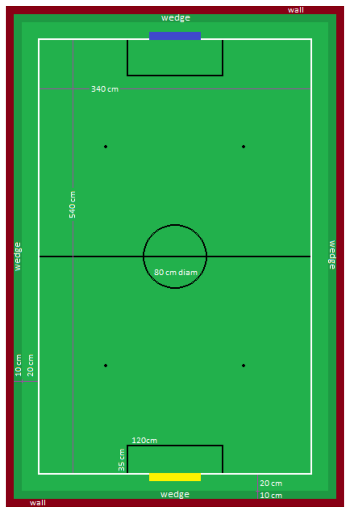

= RoboCupJunior Soccer SuperTeam Rules 2025
{docdate}
:toc: left
:sectanchors:
:sectlinks:
:xrefstyle: full
:section-refsig: Rule
:sectnums:

ifdef::basebackend-html[]
++++
<link rel="stylesheet" href="https://use.fontawesome.com/releases/v5.3.1/css/all.css" integrity="sha384-mzrmE5qonljUremFsqc01SB46JvROS7bZs3IO2EmfFsd15uHvIt+Y8vEf7N7fWAU" crossorigin="anonymous">

++++
endif::basebackend-html[]

:icons: font
:numbered:

These are the draft SuperTeam Soccer rules for RoboCupJunior 2025. They are
released by the RoboCupJunior Soccer League Committee. The English version
of these rules has priority over any translations.

Teams are advised to check the RoboCupJunior Soccer site
https://junior.robocup.org/ and Soccer forum 
https://junior.forum.robocup.org/c/robocupjunior-soccer/5
for procedures and requirements for the
international competition and with local tournament organizers for local,
regional and super-regional competitions. Each team is responsible
for verifying the latest version of the rules prior to competition. Teams
should ask for clarifications on the Forum where necessary.
footnote:[The current version of these rules can be found at
https://robocup-junior.github.io/soccer-rules/master/superteam_rules.html in HTML form
and at https://robocup-junior.github.io/soccer-rules/master/superteam_rules.pdf in PDF
form.]

TIP: Teams are encouraged to get in touch with the RoboCupJunior community on
our Discord. Show what you're working on, ask questions or join the weekly
discussions on future rules and league design. You can join the server at
https://robocup-junior.github.io/soccer-rules/discord/
You can also reach the Soccer League Committee directly via email at
robocupjunior-soccer [ at ] robocup [ dot ] org

[discrete]
== Preface

In the RoboCupJunior Soccer challenge, teams of young engineers design, build,
and program two fully autonomous mobile robots to compete against another team
in matches. The robots must detect a ball and score into a color-coded goal on
a special field that resembles a human soccer field.

To be successful, participants must demonstrate skill in programming, robotics,
electronics and mechatronics. Teams are also expected to contribute to the
advancement of the community as a whole by sharing their discoveries with other
participants and by engaging in good sportsmanship, regardless of culture, age
or result in the competition. *All are expected to compete, learn, have fun, and grow.*

**These rules are released together with the current regular game rules. Wherever
a change is needed because of the difference with regular games, situation have
been analyzed and are ruled here. For all other situations that do not change
from the regular game rules, normally they have been only mentioned here as
being the same regular game rule.**

[discrete]
=== Changes from the 2024 RoboCupJunior Soccer SuperTeam Rules

// TODO: Summarize changes here
The rule changes developed by the Soccer League Committee in cooperation with the
RoboCup Junior Soccer Community (please continue to post ideas for the future on
the forum any time) aim to improve gameplay.

Detailed changes are listed below and link to the corresponding place in the rule.

{+-~TOC-CHANGES~-+}

[[gameplay]]
== GAMEPLAY

[[game-procedure-and-length-of-a-game]]
=== Game procedure and length of a game

RCJ Soccer SuperTeam games consist of two teams of robots playing soccer
against each other. Each team has five autonomous robots. The game will consist
of two halves. The duration of each half is 10-minutes. There will be a
5-minute break in between the halves.

The game clock will run for the duration of the halves without stopping (except
when a referee wants to consult another official). The game clock will be
run by a referee or a referee assistant.

SuperTeams are expected to be at the field 5 minutes before their game starts. Being
at the inspection table does not count in favor of this time limit. Teams that
are late for the start of the game may be penalized one goal *per 30 seconds*
at the referee’s discretion.

The final game score will be trimmed so that there is at most 10-goal
difference between the losing and the winning team.

[[tournament-mode-byes]]
=== Tournament mode and Bye games
In some cases (e.g. uneven number of teams) not every team can play every round.
In threse cases the team that is free from play is awarded a Bye. In SuperTeam
matches where fewer goals are scored the Bye is awarded as a 3:0 victory instead
of the usual 10:0. Contact your regional/super-regional tournament organizers for
details at tournaments other than the international RoboCupJunior tournament.

[[pre-match-meeting]]
=== Pre-match meeting

At the start of the first half of the game, a referee will toss a coin. The
team mentioned first in the draw shall call the coin. The winner of the toss
can choose either which end to kick towards, or to kick off first. The loser of
the toss chooses the other option. After the first half, teams switch sides.
The SuperTeam not kicking off in the first half of the game will kick off to
begin the second half of the game.

During the pre-match meeting the referee or their assistant may check whether
the robots are capable of playing (i.e., whether they are at least able to
follow and react to the ball). If none of the robots is capable of playing, the
game will not be played and zero goals will be awarded to both SuperTeams.

[[kick-off]]
=== Kick-off

Each half of the game begins with a kick-off. All robots must be located on
their own side of the field. All robots must be halted. The ball is positioned
by a referee in the center of the field.

The team kicking off places their robots on the Big field first and the rest of
the robots can be located anywhere on their side of the playing field, as long
as they are at a maximum distance of 10 cm from any white line.

The SuperTeam not kicking off will now place their robots on the defensive end of
the Big field.

Robots cannot be placed behind the goal line or out of bounds. Robots cannot be
repositioned once they have been placed, except if the referee requests to
adjust their placement to make sure that the robots are placed properly within
the field positions.

On the referee’s command (usually by whistle), all robots will be started
immediately by members of the team they belong to. Any robots that are started
early will be removed by the referee from the field and deemed damaged.

Before a kick-off, *all damaged or out-of-bounds robots* are allowed to return to
the playing field immediately if they are _ready and fully functional_.

If no robots are present at a kick-off (because they have moved out-of-bounds
<<out-of-bounds>> or are damaged <<damaged-robots>>), the penalties are
discarded and the match resumes with a <<neutral-kickoff>>.

[[neutral-kickoff]]
==== Neutral kick-off

A neutral kick-off is the same as the one described in <<kick-off>> with a
small change: all robots must be at least 30 cm away from the ball
(outside of the center circle).

[[human-interference]]
=== Human interference

Except for the kick-off, human interference from SuperTeam members (e.g.
touching the robots) during the game is not allowed unless explicitly permitted
by a referee. Violating SuperTeam(s) / SuperTeam member(s) may be disqualified from
the game.

The referee or a referee assistant can help robots get unstuck if the ball is
not being disputed near them and if the situation was created from normal
interaction between robots (i.e. it was not a design or programming flaw of the
robot alone). The referee or a referee assistant will pull back the robots just
enough for them to be able to move freely again.

[[ball-movement]]
=== Ball movement

link:https://robocup-junior.github.io/soccer-rules/master/rules.html[RoboCupJunior Soccer Rules] rule <<ball-movement>> applies.

[[scoring]]
=== Scoring

A goal is scored when the ball strikes or touches the back wall of the goal.
Goals scored any robot have the same end
result: they give one goal to the SuperTeam on the opposite side. After a
goal, the game will be restarted with a kick-off from the SuperTeam who was
scored against.

After the referee signals that a goal was scored, the referee will
invite SuperTeam members to capture their robots or ask a referee to help
capture them and get ready for kick-off.

[[inside-penalty-area]]
=== Inside the Penalty Area

link:https://robocup-junior.github.io/soccer-rules/master/rules.html[RoboCupJunior Soccer Rules] rule <<inside-penalty-area>> applies.

[[lack-of-progress]]
=== Lack of progress

link:https://robocup-junior.github.io/soccer-rules/master/rules.html[RoboCupJunior Soccer Rules] rule <<lack-of-progress>> applies.

[[out-of-bounds]]
=== Out of bounds

If a robot’s entire body moves out beyond the white line of the Big field, it
will be called for being out of bounds. When this situation arises, the robot
is given a one-minute penalty, and the SuperTeam is asked to remove the robot
from the Big field. There is no time stoppage for the game itself. The robot
is allowed to return if a kick-off occurs before the penalty has elapsed.

The one-minute penalty starts when the robot is removed from play.
Furthermore, any goal scored by the penalized SuperTeam while the penalized
robot is on the Big field will not be granted. Out-of-bounds robots can be
fixed if the SuperTeam needs to do so, as described in <<damaged-robots>>.

After the penalty time has passed, robot will be placed on the unoccupied
neutral spot furthest from the ball, facing its own goal.

A referee can waive the penalty if the robot was accidentally pushed out of
bounds by an opposing robot. In such a case, the referee may
have to slightly push the robot back onto the Big field.

The ball can leave and bounce back into the Big field. The referee calls
`*out of reach*`, and will move the ball to the nearest unoccupied neutral spot
when one of the following condition occurs:

1. the ball remains outside the Big field too long, after a visible and
loud count footnote:[usually a count of three],

2. any of the robots are unable to return it into the Big field (without
their whole body leaving the Big field), or

3. the referee determines that the ball will not come back into the Big
field.

[[damaged-robots]]
=== Damaged robots

link:https://robocup-junior.github.io/soccer-rules/master/rules.html[RoboCupJunior Soccer Rules] rule <<damaged-robots>>

[[interruption-of-game-ref-interruption]]
=== Interruption of Game

link:https://robocup-junior.github.io/soccer-rules/master/rules.html[RoboCupJunior Soccer Rules] rule <<interruption-of-game-ref-interruption>> applies.

[[team]]
== SUPERTEAM

[[team-regulations]]
=== Regulations

A SuperTeam is a team of 3 or more regular teams with their corresponding
robots, all from the same sub-league. Regular team is defined on RoboCupJunior
Soccer Rules <<team-regulations>> and <<number-of-robots-substitution>>.
Each regular team is required to provide at least one robot for each SuperTeam
game.

Each SuperTeam must have a captain. The captain is the person responsible for
communication with referees. The SuperTeam can replace its captain during
the competition. SuperTeam is allowed to have only the fewest possible members beside
the field during game play: they will usually be the captain and one member
from each individual team who has a robot as an active SuperTeam player (see
Soccer Rules rule <<team-regulations>>).

[[team-violations]]
=== Violations

link:https://robocup-junior.github.io/soccer-rules/master/rules.html[RoboCupJunior Soccer Rules] rule <<team-violations>> applies.

[[robots]]
== ROBOTS

[[number-of-robots-substitution]]
=== Number of robots / substitution

The SuperTeam will have all the robots from their respective individual teams
available to play. In the playing field, the SuperTeam is allowed to use a
maximum of 5 robots simultaneously, and they are its active players. The rest
of the robots constitute their reserve players. Since the playing field is big,
it is suggested that the SuperTeam establish positions for the robots inside
the playing field (goalkeeper, backs, midfielders, forwards, etc.), by
adjusting robot's mechanics and programming.

The substitution of robots during the competition with other SuperTeam is
forbidden. Robots will be issued a special code that will distinguish them from
other SuperTeams. Each robot that belongs to a superteam will receive an ID
identifying the robot as being a member of a team.

Example: Robot A-2: the referee would identify robot with sticker A-2 as robot
number 2 belonging to team A. These IDs will be written on the Top Markers of
robots (see link:https://robocup-junior.github.io/soccer-rules/master/rules.html[RoboCupJunior Soccer Rules] rule <<top-markers>>).

Each individual team is required to have at least one of its robots as an
active player, with the exception of a sixth team in which case SuperTeam is
required to have individual team rotation allowing with that to include all
individual teams evenly. SuperTeam members can decide freely how to substitute
robots between the current players and the reserve players during gameplay, but
the captain is required to ask a referee for robot substitution authorization.

Substitutions are allowed only at every kick-off (see rule <<kick-off>>).

[[robots-interference]]
=== Interference

link:https://robocup-junior.github.io/soccer-rules/master/rules.html[RoboCupJunior Soccer Rules] rule <<robots-interference>> applies.

[[robots-control]]
=== Control

link:https://robocup-junior.github.io/soccer-rules/master/rules.html[RoboCupJunior Soccer Rules] rule <<robots-control>> applies.

[[communication]]
=== Communication

link:https://robocup-junior.github.io/soccer-rules/master/rules.html[RoboCupJunior Soccer Rules] rule <<communication>> applies.

{++To make SuperTeam games more manageable at present and make
communication between multiple robots in a SuperTeam easier in the future, the
Soccer League Committee will provide each team with a communication module. Each
team will be expected to interface with this module using a single 2.54mm GPIO
pin at present and the Soccer League Committee plans on extending this to using
UART or I²C for more complex applications in future years.

More details will be provided by the Soccer League Committee before the competition.
~>Communication module rule moved to main rules.++}

[[agility]]
=== Agility

link:https://robocup-junior.github.io/soccer-rules/master/rules.html[RoboCupJunior Soccer Rules] rule <<agility>> applies.

[[handle]]
=== Handle

link:https://robocup-junior.github.io/soccer-rules/master/rules.html[RoboCupJunior Soccer Rules] rule <<handle>> applies.

[[top-markers]]
=== Top Markers

link:https://robocup-junior.github.io/soccer-rules/master/rules.html[RoboCupJunior Soccer Rules] rule <<top-markers>> applies.

[[additional-regulations-of-the-sub-leagues]]
=== Additional regulations of the sub-leagues

link:https://robocup-junior.github.io/soccer-rules/master/rules.html[RoboCupJunior Soccer Rules] rule <<additional-regulations-of-the-sub-leagues>> applies.

[[violations]]
=== Violations

link:https://robocup-junior.github.io/soccer-rules/master/rules.html[RoboCupJunior Soccer Rules] rule <<violations>> applies.

[[field]]
== BIGFIELD

[[dimensions-of-the-field]]
=== Dimensions of the field

The Big field is 540 cm by 340 cm. The Big field is marked by a white line that
is part of the playing field. Around the playing field, beyond the white line,
is an outer area of 30 cm width. Total dimensions of the Big field, including
the outer area, are 600 cm by 400 cm. The playing area is divided in sides for
each SuperTeam by a black line.

The floor near the exterior wall includes a wedge, which is an incline with a
10 cm base and 2 +/- 1 cm rise for allowing the ball to roll back into play
when it leaves the playing field. Note that the goal should not contain the
wedge.

[[field-walls]]
=== Walls

link:https://robocup-junior.github.io/soccer-rules/master/rules.html[RoboCupJunior Soccer Rules] rule <<field-walls>> applies.

[[goals]]
=== Goals

link:https://robocup-junior.github.io/soccer-rules/master/rules.html[RoboCupJunior Soccer Rules] rule <<goals>> applies.

[[floor]]
=== Floor

link:https://robocup-junior.github.io/soccer-rules/master/rules.html[RoboCupJunior Soccer Rules] rule <<floor>> applies.

[[neutral-spots]]
=== Neutral spots

There are five neutral spots defined in the Big field. One is in the center of
the Big field. The other four are located over the diagonals that go through
the corners of the playing field, half the distance between the center of the
field and each corner. The neutral spots can be drawn with a thin black marker.
The neutral spots ought to be of circular shape measuring 1 cm in diameter.

[[center-circle]]
=== Center circle

A center circle will be drawn on the Big field. It is 80 cm in diameter. It is
a thin black marker line. It is there for Referees and SuperTeam members as
guidance during kick-off.

[[penalty-areas]]
=== Penalty areas

In front of each goal there is a 35 cm wide and 120 cm long penalty area.

The penalty areas are marked by a white line of 20 mm (±10%) width. The
line is part of the area.

[[lighting-and-magnetic-conditions]]
=== Lighting and Magnetic Conditions

RoboCupJunior Soccer Rules rule <<lighting-and-magnetic-conditions>> applies.

[[ball]]
== BALL

link:https://robocup-junior.github.io/soccer-rules/master/rules.html[RoboCupJunior Soccer Rules] rule <<ball>> and its subsections apply.

[[code-of-conduct]]
== CODE OF CONDUCT

link:https://robocup-junior.github.io/soccer-rules/master/rules.html[RoboCupJunior Soccer Rules] rule <<code-of-conduct>> and its subsections apply.

[[conflict-resolution]]
== CONFLICT RESOLUTION

link:https://robocup-junior.github.io/soccer-rules/master/rules.html[RoboCupJunior Soccer Rules] rule <<conflict-resolution>> and its subsections apply.

[discrete]
[[big-field-diagram]]
== BIG FIELD DIAGRAM

